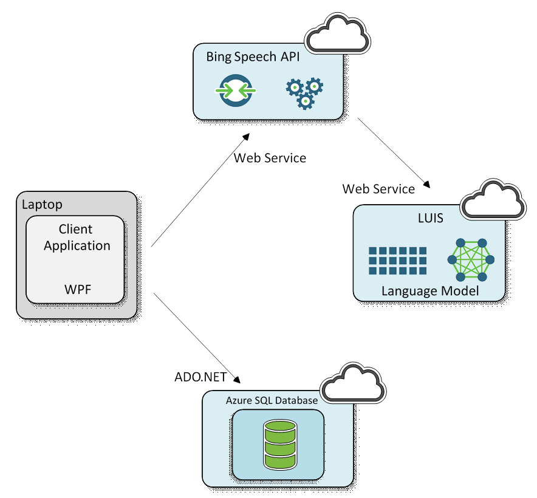

# Contoso Insurance Call Center Demo: How-to Solution Guide

#### Abstract

This demo shows a typical call center scenario for a hypothetical
company called Contoso Insurance. Contoso Insurance provides claims,
loans and grant services to its customers and customers typically call
the company to enquire about the status of these services. Contoso
Insurance plans to automate their call center for this scenario and
reduce the need for human operators.

The demo utilizes the Speech to Text and LUIS API from Microsoft’s
Cognitive Services offering. It supports two languages, English and
Chinese.

This document explains how to build the solution piece by piece. The
manual process gives an implementer an inside view on how the solution
is built and an understanding of each of the components.


#### Requirements

This section contains required accounts and software you will need to
create this solution.

1.  Windows workstation

2.  The full contents of the zip file.

3.  A Microsoft Azure subscription.

4.  A network connection

5.  [Microsoft Visual
    Studio](https://www.visualstudio.com/post-download-vs?sku=community&clcid=0x409&downloadrename=true)

6.  [SQL Server Management
    Studio](https://msdn.microsoft.com/en-us/library/mt238290.aspx) or
    another similar tool to access a SQL server database.

#### Architecture

The image in this section shows the overall architecture of the Call
Center demo, the remainder of this document describes it in detail.



The demo could be divided into following four steps

1.  Capture and recognize what a user says using the Speech APIs 

2.  Understand user’s intent using LUIS API 

3.  Generate an appropriate response by querying the database.

4.  Speak the response to the user using the Speech APIs.

Setup Steps

The remainder of this document walks the reader through the creation of
many different Cortana Intelligence Suite services with the end result
of replicating the architecture defined previously.

As there are several services, it is suggested to group these services
under a single Azure Resource Group. For more information about Azure
Resource Groups, read [*here*](https://azure.microsoft.com/en-us/documentation/articles/resource-group-overview/)

Similarly, we want to use a common name for the different services we
are creating. The remainder of this document will use the assumption
that the base service name is:

callcenterdemo\[UI\]\[n\]

Where \[UI\] is the user's initials and n is a random integer that you
choose. Characters must be entered lowercase. Several services, such as
Azure Storage, require a unique name for the storage account across a
region and hence this format should provide the user with a unique
identifier.

So for example, Steven X. Smith might use a base service name of
***callcenterdemosxs01***

Before proceeding further make sure you have downloaded the solution
package zip file with all the resources.

##### 1. Create a new Azure Resource Group

1.   Navigate to ***portal.azure.com*** and log in to your account.

2.   On the left tab click ***Resource Groups***

3.   In the resource groups page that appears, click Add

4.   Provide a name ***callcenterdemo\[UI\]\[n\]-rg***

5.   Set the location to **Central US**

6.  Select **Pin to Dashboard** option

7.  Click ***Create***


##### 2. Create Cognitive Services account for Language Understanding Intelligent Service (LUIS)

1.   Navigate to ***portal.azure.com*** and log in to your account.

2.  On the left tab click ***New***

3.   Search for ***Cognitive Services APIs,*** select it and click **create**

4.  In the create screen, for Account name, enter ***callcenterdemo\[UI\]\[n\]-luis***

5.  Select the correct subscription

6.   For API type, select **Language Understanding Intelligent Service**

7.   For Location, select **West US** (In future it would be location
    independent i.e. global)

8.   For Pricing, select **S0 Standard** tier. (You can change the tier
    later based on your usage)

9.   For Resource group, select ***Use Existing*** and then select ***callcenterdemo\[UI\]\[n\]-rg***

10.   Open Legal terms and click I Agree.

11.   Click ***Create.***

12.   It would take a minute or two for Cognitive Services API account to be created, navigate to the dashboard on Azure Portal.

13.   On the dashboard, click on your resource group,
    ***callcenterdemo\[UI\]\[n\]-rg*** and then click on the newly
    created LUIS service account, ***callcenterdemo\[UI\]\[n\]-luis***

14.   Go to Settings &gt; Keys, make a note of Key 1.


##### 3. Create Cognitive Services account for Bing Speech API

1.   Navigate to ***portal.azure.com*** and log in to your account.

2.   On the left tab click ***New***

3.   Search for ***Cognitive Services APIs,*** select it and click
    **create**

4.   For Account name, enter ***callcenterdemo\[UI\]\[n\]-speech***

5.   Select the correct subscription

6.   For API type, select **Bing Speech API**

7.   For Location, select **West US**.

8.   For Pricing, select **Standard**.

9.   For Resource group, select ***callcenterdemo\[UI\]\[n\]-rg***

10.   Open Legal terms and click I Agree.

11.   Click ***Create***

12.   Go to the dashboard of your Azure account.

13.   On the dashboard, click on your resource group,
    ***callcenterdemo\[UI\]\[n\]-rg*** and then click on the newly
    created Speech service account,
    ***callcenterdemo\[UI\]\[n\]-speech***

14.   Go to Settings &gt; Keys, make a note of Key 1 and Key 2.

##### 4. Create two LUIS applications for English and Chinese

We will first create LUIS application that understands intents for
English Speaker.

1.   Navigate to <https://www.luis.ai> and login with a
    Microsoft account.

2.   Click the **My Applications** tab on the top right.

3.   Click on **New App** button and select **Import existing
    application** option.

4.   Navigate to LUIS models folder in the solution package, select the
    **ContosoInsurance-CallCenter-English.json** file.

5.   Provide an optional name for your app, by default it would pick the
    name of the imported json file as the app name.

6.   Click Import, this would take few mins.

7.   On the newly created application page, click on **train** button on
    bottom left. This would also take few mins.

8.   The publish tab on top left should be active now, click it and
    select **Publish as web service.**

9.   Close the Publish dialog and click on the App Settings tab and make
    a note of the **App Id** and save it in the table below.

Next, we will create LUIS Application that understands intent for
Chinese speaker

1.   Follow the exact same steps as above, except select the
    **ContosoInsurance-CallCenter-Chinese.json** file on step 4.

2.   Publish the app and make a note of App Id and save it in the table
    below, we will need it later.

3.   In the LUIS portal (luis.ai), click on your account name on top
    right and select My Settings.

4.   Under My Settings, go to Subscription Keys section and add the
    **LUIS API Account Key** that you saved in the previous step and
    click on Add Key button.

5.   Make sure the key shows up in Assigned Key section for
    your applications.

##### 5. Azure SQL Server and Database

> We need to create an Azure SQL Database to store customer information
> and status of their claims. The demo would look customers up in this
> database.

1.   Navigate to ***portal.azure.com*** and login in to your account.

2.   On the left tab click ***New&gt;Data and Storage&gt;SQL Database***

3.   Enter the name ***callcenterdemo\[UI\]\[n\]-db*** for the database
    name

4.   Resource group: Previously created
    ***callcenterdemo\[UI\]\[n\]-rg***

5.   Select blank database for ***source***

6.   Under Server click the arrow and choose ***Create a new server***

    -   Name: **callcenterdemo\[UI\]\[n\]-server**

    -   Enter in an administrator account name and password and save it
        to the table below.

    -   Choose **Central US** as the location to keep the resource in
        the same region as the rest of the services.

    -   Leave other fields to be default.

    -   Click OK

7.   Click ***Create***

8.   Wait for the database and server to be created.

9.   Type D, this command will take you the dashboard of your
    Azure account.

10.   On the dashboard, click on your resource group,
    ***callcenterdemo\[UI\]\[n\]-rg*** and then click on the newly
    created SQL Server in the list of resources.

11.   Under ***Settings*** for the new server, click ***Firewall*** and
    create a rule called ***open*** with the IP range of 0.0.0.0
    to 255.255.255.255. This will allow you to access the database from
    your desktop. Click ***Save.***

    **NOTE:** This firewall rule is not recommended for production level
    systems but for this demo is acceptable. You will want to set this
    rule to the IP range of your secure system.

12.   Click on the SQL Server Database that you just created, under
    properties tab click on “**show database connection strings**”.

13.   Save the connection string for ADO.NET along with username and password

14.   Launch [*SQL Server Management Studio*](https://msdn.microsoft.com/en-us/library/mt238290.aspx)
    (SSMS), or a similar tool, and connect to the database with the
    information you recorded previously. Following instructions
    are for SSMS

    - NOTE: The server name in most tools will require the full name:
    **callcenterdemo\[UI\]\[n\]-server.database.windows.net,1433**

    -   For Authentication, select SQL Server Authentication and enter the
    Login and Password

    -   Click on the ***callcenterdemo*\[UI\]\[n\]-*db*** that you created
    on the server.

    -   Click ***New Query*** at the tool bar.

    -   Copy and execute the SQL script located in the package directory
    ***SQL Script\\databasescript.sql to*** create the necessary table
    for the demo <br/>
     NOTE: If you get permission denied error, close SSMS and try running
    it as administrator (Right Click &gt; Run as administrator).

##### 6. Build the source code with new credentials.

1.   You will need Visual Studio to work with code, you can install it
    from
    [here](https://www.visualstudio.com/post-download-vs?sku=community&clcid=0x409&downloadrename=true)

2.   Unzip the Source code folder and navigate to it.

3.   Double click on the solution file (.sln extension), this will open
    the solution in Visual Studio.

4.   Open **App.config** file and fill in the values from the above
    tables under appSettings section. Following are the values you need
    to change

```
<!-- This is the appID for the English Version of LUIS Model -->
<add key="luisAppID" value="CHANGE_ME" />

<!-- This is the appID for the Chinese Version of LUIS Model -->
<add key="luisAppIDChinese" value="CHANGE_ME" />

<!-- This is the key of the LUIS API Cognitive services account that you want    to be charged, this will be under Cognitive Services in your subscription -->
<add key="luisAPIAccountKey" value="CHANGE_ME" />

<!-- This is the primary key of the Speech API Cognitive services account that you want to be charged, it will be under Cognitive Services in your subscription                                                         -->
<add key="speechAPIAccountKey" value="CHANGE_ME" />

<!-- This is the secondary key of the Speech API Cognitive services account that you want to be charged, this will be under Cognitive Services in your subscription -->
<add key="speechAPISecondaryAccountKey" value="CHANGE_ME" />

<!-- Azure SQL Connection String, you can get it from portal.azure.com -->
<add key="dbConnectionString" value="CHANGE_ME"/>    
```
5.  To build your code, select Debug from Solution Configurations
    dropdown and select x64 for solution platforms dropdown.

6.  Click on the green start icon.

7.   You should now have a working demo.

8.    To Test the Demo, you need to have working speaker and microphone
      - Dial 132307, you will hear a telephone ring.
      - When the system prompts, ask the question - " What is the status of my claim?"
      - When prompted for CRN, say "56788"

      **NOTE: Please watch the demo video (DemoVideo-English.mp4) to see it in action.**

##### 7.  Publishing the demo

1.   Click Build and then select “Publish CI\_CallCenterDemo”

2.   This will open the publish wizard.

3.   On Publish wizard, select the location on your machine where you
    want to publish the demo.

4.   Click Next, and select from CD-ROM or DVD-ROM.

5.   On the next screen, select “The application will not check for
    updates”

6.   Click Next and then select Finish.

7.   The publish folder will have an .exe file, you can install the demo
    locally using this file.
